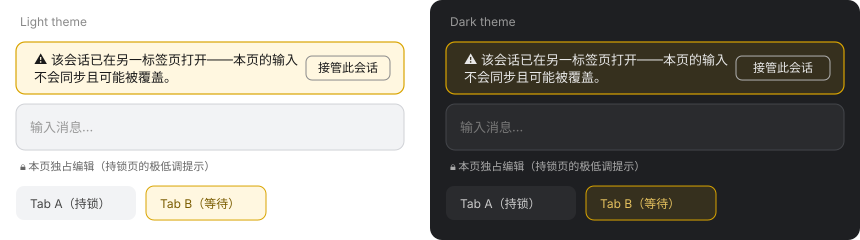
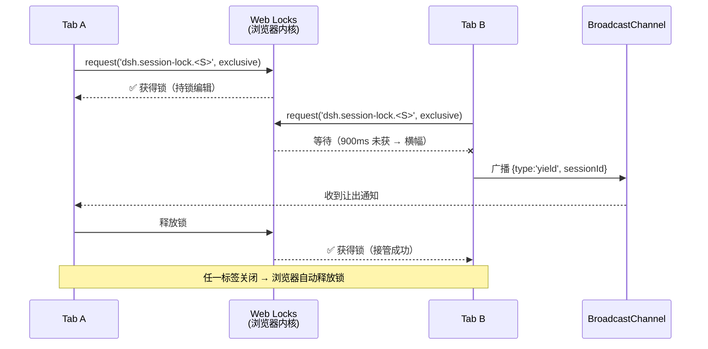

# 🔒 dsh-session-lock

> **给 DeepSeek Harness 的跨标签页会话互斥锁** —— 让多开标签成为安全操作，而不是事故现场。

[English](README_EN.md) | 中文


---

## 为什么需要它

在 DSH **0.1.2 及更早版本**中，如果你在同一浏览器里用**两个标签页**打开同一个会话：

1. 在 Tab A 输入文字 → 切到 Tab B 看一眼 → 切回来……**输入没了**；
2. 有时输入框里还会冒出**一段你没打过的乱文字**（另一页的 AI 回复流残片被同步进了草稿）；
3. 你以为是中病毒了，其实是两个页面在**互相覆盖彼此的草稿状态**。

这是多页面并发编辑同一会话的经典冲突。DSH 官方在 0.1.3 才引入**进程级**会话锁——但单进程内的多标签页它管不到。

**dsh-session-lock 补上的正是这块空白**：用浏览器原生的 [Web Locks API](https://developer.mozilla.org/en-US/docs/Web/API/Web_Locks_API) 给每个会话加一把**页面级独占锁**，冲突从"无声覆盖"变成"一目了然 + 一键接管"。

## 界面效果

两个标签页打开同一会话时，第二个标签页会在输入框上方看到醒目的警告横幅（颜色跟随 DSH 明暗主题自动适配）：



持锁的页面则只显示一行极低调的状态提示：

> 🔒 本页独占编辑

## ✨ 特性一览

| 特性 | 说明 |
|---|---|
| 🔒 **原生互斥** | 每会话一把 Web Locks 独占锁；标签页**关闭 / 切走即自动释放**（浏览器保证，无心跳、无泄漏） |
| ⚠️ **冲突可见** | 第二个打开同一会话的标签页显示警告横幅，不再无声互相覆盖 |
| ⚡ **一键接管** | 横幅「接管此会话」→ 经 BroadcastChannel 通知持锁页让出 → 本页立即获得编辑权 |
| 🌗 **主题自适应** | 全部颜色使用 DSH 官方主题变量 `--dsw-alias-*`，浅色 / 深色主题均可读 |
| 🪶 **零依赖零 host** | 纯 Client 插件：无 host 状态、无网络请求、无存储写入、不碰你的数据 |
| 📦 **极轻量** | bundle 仅 ~7 KB（gzip ~2.9 KB） |
| 🔇 **不打扰** | 持锁页只显示一行 11px 小字；无冲突时你甚至注意不到它的存在 |
| 🧹 **自动跳过** | 不支持 Web Locks 的浏览器自动降级，零干扰 |

## 📦 安装

### 方式一：npm（推荐）

```bash
npm install dsh-session-lock
```

然后把包名加入 profile 的 bundles 列表（`dsh.plugin add dsh-session-lock`，或手动写入 profile `package.json` 的 `dsh.profile.bundles` 数组），重启 dsh。

### 方式二：从 Release 安装

从 [Releases](https://github.com/windy-0-0/dsh-session-lock/releases) 下载 `dsh-session-lock-*.tgz`，解压后作为本地 bundle 装配。

### 方式三：dsh-super-injector 生态（免重启热装配）

在 dsh-super-injector 环境中调用 `dev_inject_plugin <本插件目录>`，页面会在数秒内自动刷新并生效。

## 🚀 快速体验（30 秒）

1. 打开 DSH，进入任意会话（记为 Tab A）；
2. **再开一个标签页**，打开**同一个会话**（Tab B）；
3. 观察：
   - Tab A：输入框上方出现低调的 `🔒 本页独占编辑`；
   - Tab B：约 1 秒后出现黄色警告横幅 + `接管此会话` 按钮；
4. 在 Tab B 点击 **接管此会话**：锁转移——Tab B 变持锁方，Tab A 显示横幅；
5. 关闭任意一个标签：锁自动释放，剩下的标签自动成为持锁方。

从此多开标签不再是"赌运气"——你永远知道哪个页面才是活的。

## ⚙️ 工作原理



三个设计要点：

- **锁名隔离**：`dsh.session-lock.<sessionId>` 命名空间，与其它插件/未来的官方锁互不干扰；
- **身份唯一**：每页用 `crypto.randomUUID()` 生成标签页 ID（无痕窗口也彼此独立）；
- **诚实边界**：DSH 目前没有公开的"禁用输入框"API，所以未持锁页用**醒目横幅**而不是物理锁死键盘——但你绝不会再"无声"地输错页。

## 🆚 与官方 0.1.3 会话锁的定位

| 维度 | 官方 0.1.3 进程级锁 | dsh-session-lock 页面级锁 |
|---|---|---|
| 防护对象 | 多**进程**并发写同一会话 | 单进程内多**浏览器页面** |
| 锁粒度 | 进程持有 | 标签页持有 |
| 关闭标签自动释放 | 不适用 | ✅ Web Locks 保证 |
| 用户可见性 | 无 UI | ✅ 横幅 + 接管按钮 |
| 两者关系 | **互补**：升级到 0.1.3 之后本插件依然有用 | 同左 |

## 📋 兼容性

- **DSH**：0.1.2-rc.x 及更新版本（Web UI）
- **浏览器**：Edge / Chrome / Firefox 96+ / Safari 15.4+（支持 Web Locks）
- **插件共存**：与 dsh-defend / dsh-genui / dsh-filesnap 等无冲突——只注册 `conversation.input.dock` 一个条目（id `dsh-session-lock`），不动任何其它 UI

## ❓ FAQ

**Q：为什么不在未持锁页物理禁用输入框？**
A：DSH 0.1.2 的输入 API（`inputActions`）只有 `setDraft` / `submit` 等，没有公开的锁定接口。强行 hack 编辑器 DOM 是脆弱的（版本升级即碎）。横幅方案稳定且诚实：冲突不再无声发生。

**Q：锁会不会一直占着不释放？**
A：不会。Web Locks 由浏览器内核管理：标签页关闭、页面崩溃、切换会话都会自动释放，无心跳续约、无僵尸锁。

**Q：无痕窗口 / 多浏览器窗口之间锁有效吗？**
A：有效。Web Locks 与 BroadcastChannel 都是**同源共享**的（`http://127.0.0.1:3080`），无痕窗口、普通窗口、多窗口之间全部互通。

**Q：对性能有影响吗？**
A：可忽略。每会话一次锁请求 + 持锁期间零开销；锁状态提示的渲染是 11px 小字，不触发重排。

**Q：支持不支持 Web Locks 的浏览器怎么办？**
A：自动跳过——不注册任何 UI，行为与未安装插件完全一致。

**Q：v0.1.1 之后为什么有"自动生效"？**
A：配合 dsh-super-injector ≥ 0.3.4 的注入 epoch 机制：注入含 UI 的插件后页面端 2.5 秒轮询发现变更并自动整页刷新，无需手动 F5（本插件是该机制的早期受益者之一）。

## 🛠 开发与构建

```bash
git clone https://github.com/windy-0-0/dsh-session-lock.git
cd dsh-session-lock
npm install
npm run build:all    # tsc（host）+ tsdown（client → lib/client.js）
```

- `src/client/index.ts`：全部核心逻辑（锁竞争 + 横幅 UI）
- `src/index.ts`：host 半（无状态占位）
- CI（`.github/workflows/ci.yml`）：push 自动 build + typecheck + 产物校验；打 `v*` tag 自动发布 npm（需配置 `NPM_TOKEN` secret）

## 🤝 贡献

欢迎一切形式的贡献：Bug 报告、功能建议、PR、本地化。请保持：

- 不引入新的 host 状态或网络依赖（本插件的卖点就是零依赖）；
- 颜色只用 DSH 主题变量（`--dsw-alias-*`）；
- 提交前跑 `npm run build:all` 保证可构建。

## 📜 License

[BSD-3-Clause](LICENSE) © 2026 windy-0-0

---

**如果这个插件帮你省下了一次"输入消失"的抓狂，请点个 ⭐ —— 顺便看看 dsh 生态的其它宝藏。**
