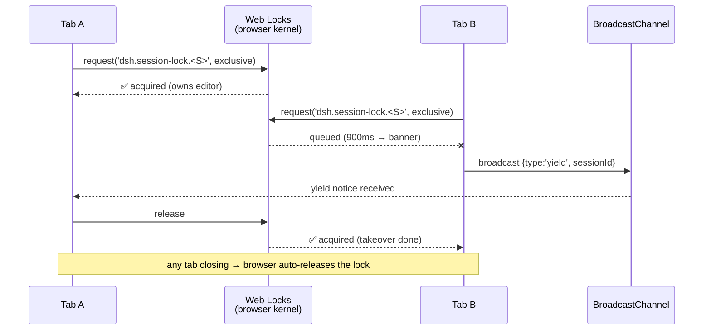

# 🔒 dsh-session-lock

> **Cross-tab session mutex for DeepSeek Harness** — make multi-tab editing a safe operation, not an accident scene.

English | [中文](README.md)


---

## Why

On DSH **≤ 0.1.2**, opening the **same session in two browser tabs** is a footgun:

1. You type in Tab A, glance at Tab B, come back — **your draft is gone**;
2. Sometimes gibberish text you never typed appears in the composer (fragments of the other tab's streaming reply get synced into the draft);
3. It feels like malware — it's actually two pages **silently overwriting each other's draft state**.

This is the classic multi-page concurrent-edit conflict. DSH 0.1.3 added a **process-level** session lock — but it cannot protect multiple tabs *inside a single process*.

**dsh-session-lock fills exactly that gap**: a **page-level exclusive lock per session** built on the browser-native [Web Locks API](https://developer.mozilla.org/en-US/docs/Web/API/Web_Locks_API). Conflicts go from *silent corruption* to *visible banner + one-click takeover*.

## What it looks like

When a second tab opens the same session, it shows a warning banner above the composer (colors follow the DSH light/dark theme automatically):


The lock-owning tab shows only a subtle one-line hint:

> 🔒 This tab owns the editor

## ✨ Features

| Feature | Description |
|---|---|
| 🔒 **Native mutual exclusion** | One exclusive Web Locks lock per session; released automatically by the browser when a tab closes / switches away — no heartbeat, no leaks |
| ⚠️ **Visible conflicts** | The second tab opening a session gets a warning banner instead of silent overwrites |
| ⚡ **One-click takeover** | The banner's "Take over" button notifies the holder via BroadcastChannel; this tab acquires the lock immediately |
| 🌗 **Theme-aware** | All colors use DSH theme tokens (`--dsw-alias-*`); readable in both light and dark themes |
| 🪶 **Zero host, zero deps** | Pure client plugin: no host state, no network requests, no storage writes, never touches your data |
| 📦 **Tiny** | ~7 KB bundle (gzip ~2.9 KB) |
| 🔇 **Unobtrusive** | The holder sees one 11px line; without a conflict you barely notice it exists |
| 🧹 **Graceful fallback** | Browsers without Web Locks are skipped automatically — zero interference |

## 📦 Install

### Option 1: npm (recommended)

```bash
npm install dsh-session-lock
```

Then add the package to your profile bundles (`dsh.plugin add dsh-session-lock`, or append it to the `dsh.profile.bundles` array in the profile `package.json`) and restart dsh.

### Option 2: Release tarball

Grab `dsh-session-lock-*.tgz` from the [Releases](https://github.com/windy-0-0/dsh-session-lock/releases) page and mount it as a local bundle.

### Option 3: dsh-super-injector ecosystem (restart-free)

In a dsh-super-injector environment, call `dev_inject_plugin <this-directory>` — open pages hot-reload within seconds.

## 🚀 Quick demo (30 seconds)

1. Open a session in DSH (call it Tab A);
2. **Open a second tab** with the **same session** (Tab B);
3. Observe:
   - Tab A: a subtle `🔒 This tab owns the editor` hint above the composer;
   - Tab B: after ~1 s, a warning banner with a **Take over** button;
4. Click **Take over** in Tab B: the lock transfers — Tab B owns it, Tab A shows the banner;
5. Close either tab: the lock is released automatically and the surviving tab takes over.

No more guessing which page is live.

## ⚙️ How it works



Design notes:

- **Namespaced lock names** `dsh.session-lock.<sessionId>` — isolated from other plugins and from the future official lock;
- **Per-tab identity** via `crypto.randomUUID()` (independent per incognito window);
- **Honest boundary**: DSH exposes no public "disable the composer" API, so a non-owning tab shows a **prominent banner** instead of physically locking the keyboard — but you will never again type into the wrong page *silently*.

## 🆚 Relationship to the official 0.1.3 session lock

| | Official 0.1.3 process lock | dsh-session-lock page lock |
|---|---|---|
| Guards against | concurrent **processes** writing one session | concurrent **browser pages** in one process |
| Lock scope | process-held | tab-held |
| Auto-release on tab close | n/a | ✅ guaranteed by Web Locks |
| User visibility | no UI | ✅ banner + takeover button |
| Relationship | **Complementary** — still useful after upgrading to 0.1.3 | same |

## 📋 Compatibility

- **DSH**: 0.1.2-rc.x and newer (Web UI)
- **Browsers**: Edge / Chrome / Firefox 96+ / Safari 15.4+ (Web Locks support)
- **Coexistence**: no conflicts with dsh-defend / dsh-genui / dsh-filesnap — registers a single `conversation.input.dock` entry (id `dsh-session-lock`), touching nothing else

## ❓ FAQ

**Q: Why not physically disable the composer on non-owning tabs?**
A: DSH ≤ 0.1.2's input API (`inputActions`) only offers `setDraft` / `submit` — no public lock interface. Hacking the editor DOM would be fragile and break on every upgrade. The banner approach is stable and honest: conflicts no longer happen silently.

**Q: Can a lock get stuck forever?**
A: No. Web Locks is managed by the browser kernel: tab close, page crash, or session switch all release the lock automatically. No heartbeat, no zombie locks.

**Q: Does the lock work across incognito windows / multiple windows?**
A: Yes. Web Locks and BroadcastChannel are shared per origin (`http://127.0.0.1:3080`) — incognito, normal, and multiple windows all see each other.

**Q: Any performance impact?**
A: Negligible. One lock request per session; zero overhead while holding it; the hint is an 11px line that triggers no reflow.

**Q: Browsers without Web Locks?**
A: Skipped automatically — no UI registered, behavior identical to the plugin not being installed.

**Q: What is the "hot-reload" mentioned after v0.1.1?**
A: With dsh-super-injector ≥ 0.3.4, injecting a UI plugin bumps a reload epoch; open pages poll every 2.5 s and reload automatically. No manual F5 needed.

## 🛠 Development

```bash
git clone https://github.com/windy-0-0/dsh-session-lock.git
cd dsh-session-lock
npm install
npm run build:all    # tsc (host) + tsdown (client → lib/client.js)
```

- `src/client/index.ts` — all core logic (lock contention + banner UI)
- `src/index.ts` — host half (stateless placeholder)
- CI (`.github/workflows/ci.yml`): build + typecheck + artifact check on push; publishing to npm automatically on `v*` tags (requires the `NPM_TOKEN` secret)

## 🤝 Contributing

Bug reports, feature ideas, PRs, and translations are all welcome. Please keep:

- No new host state or network dependencies (zero-dependency is the selling point);
- Colors use DSH theme tokens (`--dsw-alias-*`) only;
- Run `npm run build:all` before submitting.

## 📜 License

[BSD-3-Clause](LICENSE) © 2026 windy-0-0

---

**If this plugin saved you one "my input disappeared" panic, give it a ⭐.**
